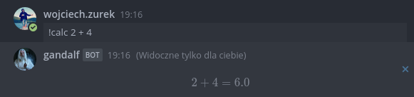
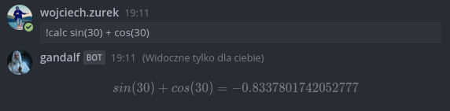
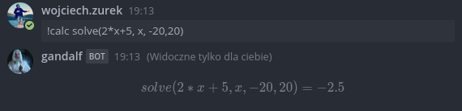
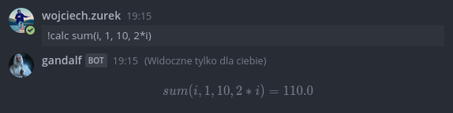

# Simple Mattermost bot for calculating math expressions






This project uses https://github.com/mariuszgromada/MathParser.org-mXparser

Mattermost: https://github.com/mattermost

Project docker hub: https://hub.docker.com/r/wojciechzurek/mattermost-calc-bot

Docker run:
```
docker run -e MATTERMOST_KEY='bot-token' -e MATTERMOST_API_ENDPOINT='https://your-mattermost-host.com/api/v4' wojciechzurek/mattermost-calc-bot:{version}
```